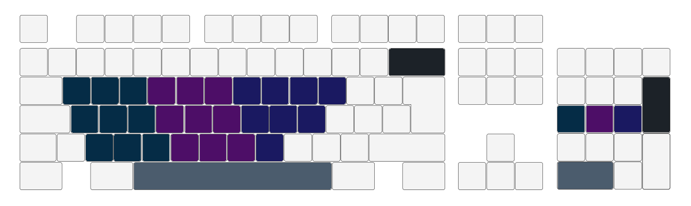

Nine is a pseudo chording keyboard scheme using numpad. Middle row of numpad
work as modifiers for covering corresponding span in full keyboard matching the 9
numpad keys. Single handed typing leaves other hand free for eating.

Tentative mapping is shown below.

- Install as chrome extension
- Press <kbd>up</kbd> <kbd>right</kbd> <kbd>down</kbd> <kbd>left</kbd>
  <kbd>up</kbd> in sequence to enable/disable
